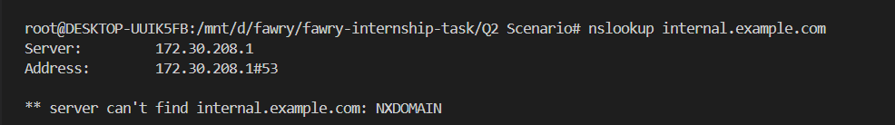
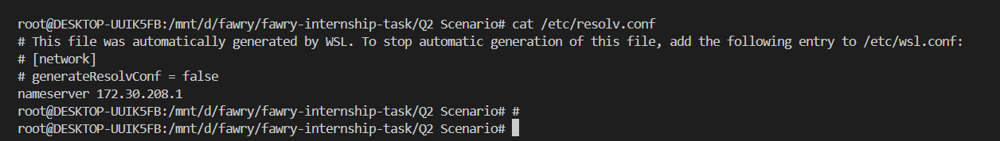
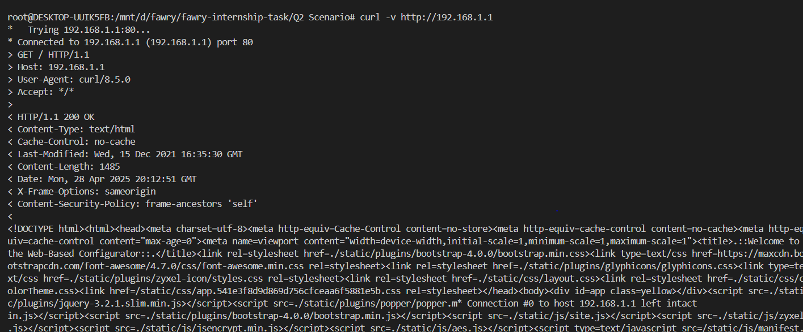

# Troubleshooting Unreachable Internal Web Dashboard (internal.example.com)

## Introduction

This document outlines the steps and potential scenarios for troubleshooting why the internal web dashboard hosted at `internal.example.com` is unreachable, with users receiving "host not found" errors despite the service seemingly being up. We will cover verifying DNS resolution, diagnosing service reachability, identifying potential causes, and proposing conceptual fixes.

## Step 1: Verify DNS Resolution

We will check if the hostname `internal.example.com` is resolving correctly by comparing resolution from the system's configured DNS server (`/etc/resolv.conf`) with a public DNS server (8.8.8.8).

### Scenario 1.1: `/etc/resolv.conf` DNS is not resolving the hostname.

* **Symptoms:** `nslookup internal.example.com` fails,


while `nslookup internal.example.com 8.8.8.8` succeeds.

* **Potential Cause:** The DNS server configured in `/etc/resolv.conf` might be malfunctioning or not have the correct record for `internal.example.com`.

* **Troubleshooting:**
    * Examine the `/etc/resolv.conf` file to identify the configured DNS server:
        ```bash
        cat /etc/resolv.conf
        ```
    

    * Try pinging the configured DNS server to check basic connectivity:
        ```bash
        ping <configured_dns_server_ip>
        ```
    
### Scenario 1.2: Both `/etc/resolv.conf` DNS and 8.8.8.8 fail to resolve the hostname.

* **Symptoms:** Both `nslookup internal.example.com` and `nslookup internal.example.com 8.8.8.8` fail to resolve the hostname.
* **Potential Cause:** This suggests a broader DNS issue, such as:
    * The internal DNS server responsible for `example.com` is down or has an issue.
    * There might be a problem with the root hints or forwarders configured on the internal DNS server.
    * The DNS record for `internal.example.com` might be missing entirely.

## Step 2: Diagnose Service Reachability

Even if DNS resolution works, we need to confirm if the web service is listening on the resolved IP address and the standard HTTP/HTTPS ports (80 and 443).

### Scenario 2.1: The service is not listening on the expected ports.

* **Symptoms:** `netstat -tulnp | grep ":80\|:443"` or `ss -tulnp | grep ":80\|:443"` shows no process listening on ports 80 or 443 for the resolved IP address.fails to connect with a "Connection refused" error.
* **Potential Cause:**
    * The web server application might not be running.
    * The web server is running but configured to listen on different ports or a different IP address.
    * The web server process might have crashed.
* **Troubleshooting:**
    * Check listening ports:
        ```bash
        netstat -tulnp | grep ":80\|:443"
        ss -tulnp | grep ":80\|:443"
        ```
    * Try connecting with telnet:
        ```bash
        telnet <resolved_ip> 80
        telnet <resolved_ip> 443
        ```

### Scenario 2.2: The service is listening, but not responding to HTTP requests.

* **Symptoms:** `netstat` or `ss` shows the service listening on ports 80 or 443. `telnet <resolved_ip> 80` or `telnet <resolved_ip> 443` might connect, but sending HTTP commands (like `GET / HTTP/1.0`) results in no response or a timeout. `curl -v http://<resolved_ip>`.
* **Potential Cause:**
    * The web server application is overloaded or experiencing errors.
    * Firewall rules on the server are preventing proper communication.
    * The web server's virtual host configuration for the resolved IP is incorrect.
* **Troubleshooting:**
    * Try making a basic HTTP request with curl:
        ```bash
        curl -v http://<resolved_ip>
        curl -v https://<resolved_ip>
        ```
        

## Step 3: Trace the Issue – Potential Causes

Here's a summary of potential reasons why `internal.example.com` might be unreachable:

**DNS Related Issues:**

1.  Incorrect DNS Server Configuration (client-side)
2.  DNS Server Down (internal DNS infrastructure)
3.  Incorrect or Missing DNS Record (`internal.example.com`)
4.  DNS Propagation Delay.
5.  Firewall Blocking DNS Queries.

**Network/Service Related Issues:**

6.  Web Server Application Down
7.  Web Service Not Listening on Ports 80 or 443
8.  Firewall Blocking Web Traffic (server or network - TCP ports 80/443)
9.  Network Connectivity Issues between Client and Server
10. Incorrect IP Address Configuration on the Web Server
11. Load Balancer Issues if we use it.
12. Virtual Host Configuration Errors on the Web Server
13. TLS/SSL Certificate Issues (less likely for "host not found")
14. Resource Exhaustion on the Web Server

## Step 4: Propose and Apply Fixes (Conceptual)

For each potential cause identified above, the troubleshooting process would involve:

1.  **Confirmation:** Using appropriate commands (like `nslookup`, `dig`, `ping`, `telnet`, `netstat`, `ss`, `curl`, `traceroute`) to verify if the specific issue is the root cause.
2.  **Fix:** Applying the necessary corrective actions, which might include:
    * Modifying DNS server configurations (`/etc/resolv.conf`).
    * Restarting DNS or web server services (`sudo systemctl restart <service>`).
    * Correcting DNS records via the DNS server management interface or zone files.
    * Flushing local DNS caches (`sudo systemctl restart systemd-resolved`, `sudo /etc/init.d/nscd restart`, `sudo dscacheutil -flushcache -v`, `ipconfig /flushdns`).
    * Adjusting firewall rules (`sudo iptables`, `sudo ufw`, network device configurations).
    * Troubleshooting network connectivity (`ping`, `traceroute`, checking physical connections).
    * Reconfiguring the web server's listening ports or virtual host settings (configuration file locations vary).
    * Investigating load balancer health checks and configurations.
